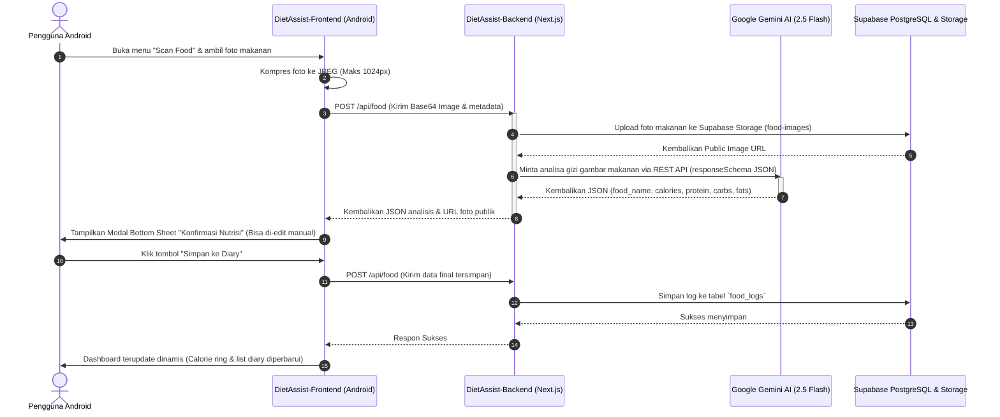
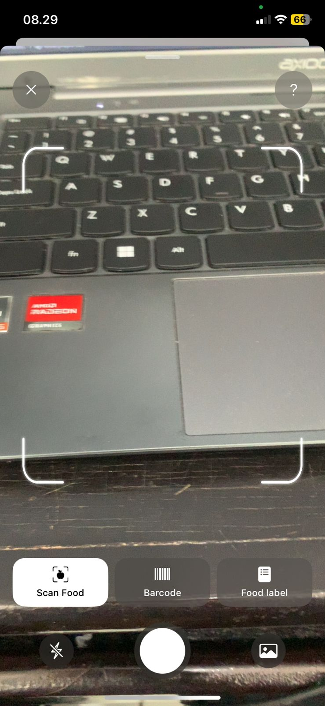
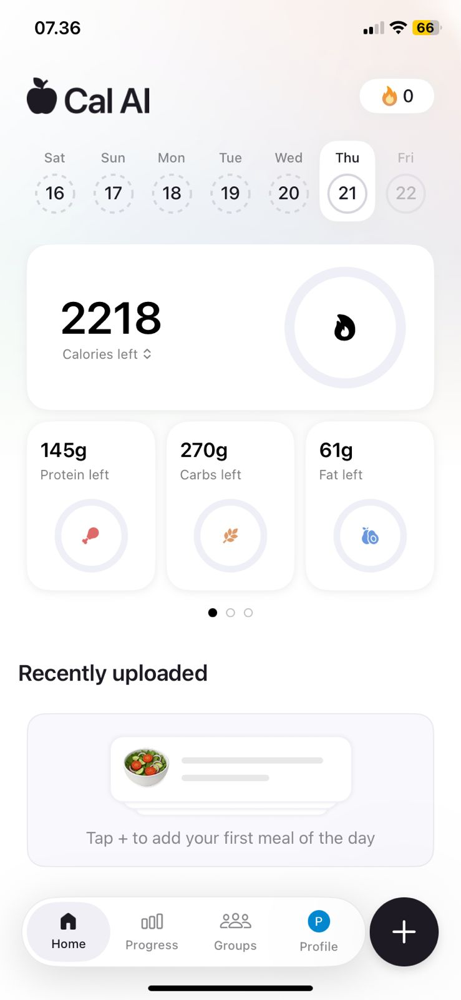
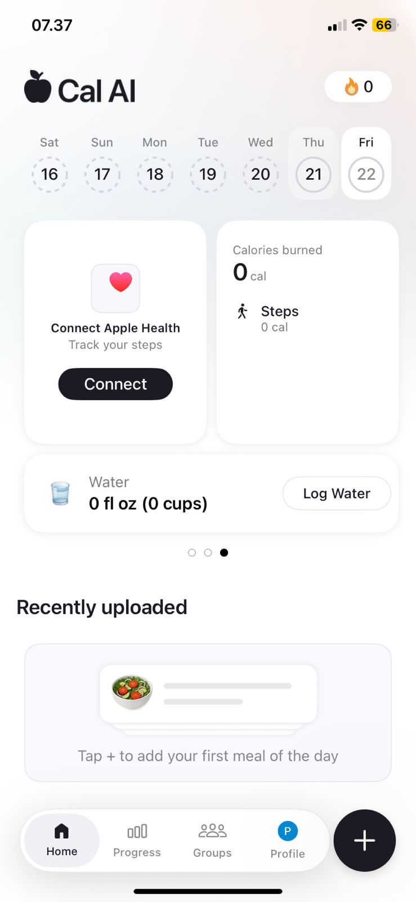
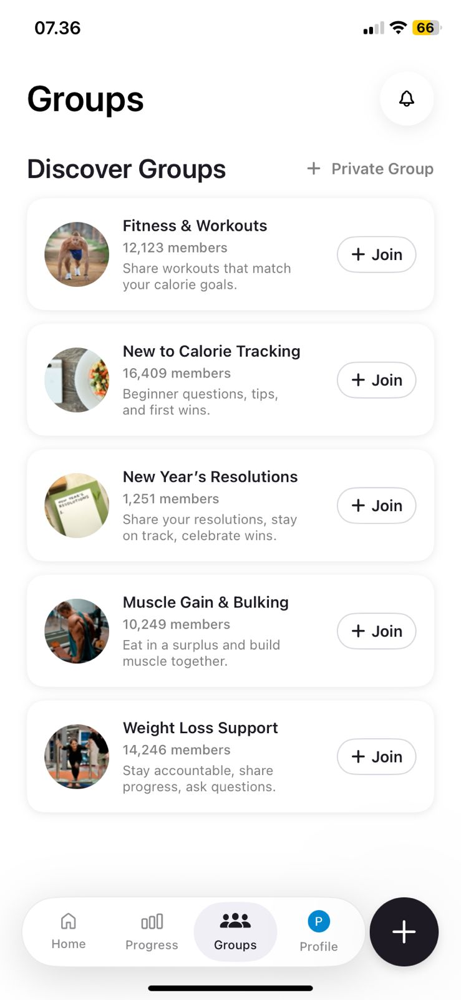
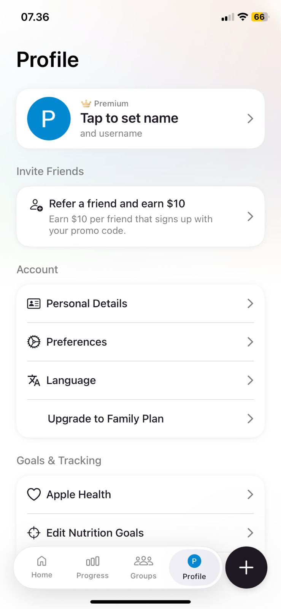

# 🍎 DietAssist: AI-Powered Smart Nutritionist & Diet Companion

[](https://kotlinlang.org/)
[](https://nextjs.org/)
[](https://supabase.com/)
[](https://deepmind.google/technologies/gemini/)

> **DietAssist** adalah ekosistem aplikasi pelacakan diet cerdas modern yang menggabungkan kemudahan aplikasi mobile berbasis Android (Jetpack Compose) dengan kekuatan analisis visual kecerdasan buatan (Computer Vision) dan Natural Language Processing (NLP) dari Google Gemini 2.5 Flash di sisi backend.

---

## 📖 Daftar Isi
1. [Latar Belakang & Mengapa DietAssist Dibuat](#-latar-belakang--mengapa-dietassist-dibuat)
2. [Manfaat Aplikasi](#-manfaat-aplikasi)
3. [Tujuan Pembuatan APK (Aplikasi Mobile)](#-tujuan-pembuatan-apk-aplikasi-mobile)
4. [Cara Kerja Sistem](#-cara-kerja-sistem)
5. [Tech Stack & Arsitektur Teknologi](#-tech-stack--arsitektur-teknologi)
6. [Struktur Repositori](#%EF%B8%8F-struktur-repositori)
7. [Dokumentasi API Backend](#-dokumentasi-api-backend)
8. [Alur Skenario Penggunaan Super Detail](#%EF%B8%8F-alur-skenario-penggunaan-super-detail)
9. [Panduan Instalasi & Konfigurasi](#-panduan-instalasi--konfigurasi)
10. [Galeri Screenshot Aplikasi](#-galeri-screenshot-aplikasi)

---

## 🔍 Latar Belakang & Mengapa DietAssist Dibuat

Dalam kehidupan modern yang serba cepat, menjaga pola makan sehat dan mencapai berat badan ideal merupakan tantangan besar bagi banyak orang. Beberapa kendala utama yang sering dihadapi meliputi:
*   **Kesulitan Menghitung Kalori secara Manual:** Mencari kandungan kalori bahan makanan satu per satu sangat melelahkan dan memakan banyak waktu.
*   **Kurangnya Informasi Gizi pada Makanan Lokal:** Makanan rumahan atau jajanan pasar tradisional (seperti nasi uduk, gado-gado, ketoprak) tidak memiliki label informasi nilai gizi resmi, membuat pengguna kesulitan memperkirakan asupan mereka.
*   **Prosedur Log Makanan yang Rumit:** Aplikasi diet konvensional mengharuskan pengguna mengisi formulir porsi makanan secara detail yang berujung pada penurunan motivasi pelacakan gizi (user fatigue).
*   **Kurangnya Edukasi Gizi Instan:** Sulit mendapatkan saran diet yang dipersonalisasi dengan cepat tanpa harus membayar mahal untuk konsultasi ke ahli gizi medis.

**DietAssist hadir sebagai solusi cerdas.** Dengan memadukan teknologi kecerdasan buatan (**Google Gemini 2.5 Flash**) dan kemudahan platform mobile, pengguna hanya perlu mengambil foto makanan atau mengetik deskripsi singkat. AI akan secara otomatis mengenali jenis makanan, menghitung estimasi kalori serta makronutrisi (karbohidrat, protein, lemak), dan menyajikannya dalam bentuk diary yang interaktif dan mudah dikelola.

---

## 🌟 Manfaat Aplikasi

DietAssist dirancang untuk memberikan dampak positif langsung terhadap kesehatan pengguna:
*   **Pelacakan Nutrisi Tanpa Ribet (Instant Logging):** Mengurangi waktu pencatatan makanan dari menit menjadi detik melalui bantuan pemindaian kamera AI.
*   **Estimasi Akurat Gizi Makanan Lokal:** Model AI dilatih (melalui prompt engineering terstruktur) untuk mengenali masakan Indonesia dan internasional lengkap dengan porsi standar secara cerdas.
*   **Penyadaran Diri Hidrasi (Hydration Awareness):** Membantu pengguna memantau asupan air harian untuk menjaga metabolisme tubuh tetap optimal.
*   **Konsultasi Diet Interaktif Gratis:** Menyediakan pendamping kesehatan AI (**DietAssistAi**) 24/7 untuk menjawab pertanyaan diet, menyusun rencana makan, atau memberi rekomendasi pengganti bahan makanan yang lebih sehat.
*   **Evaluasi Keberhasilan Diet Visual:** Grafik kemajuan mingguan yang elegan memberikan umpan balik instan apakah asupan harian telah sesuai dengan target defisit, pemeliharaan (maintenance), atau surplus kalori pengguna.

---

## 📱 Tujuan Pembuatan APK (Aplikasi Mobile)

Modul Android APK pada repositori [DietAssist-Frontend](file:///c:/Users/Hype/Documents/PAB/DietAssist/DietAssist-Frontend) dibuat untuk:
1.  **Aksesibilitas On-The-Go:** Memungkinkan pengguna memfoto makanan mereka langsung di atas meja makan secara portabel sebelum makan.
2.  **Integrasi Kamera Native:** Menggunakan pustaka Jetpack CameraX untuk performa jepretan kamera yang cepat, bersih, dan hemat daya.
3.  **UI/UX Premium & Responsif:** Mengimplementasikan desain modern bermotif *Neo-brutalism & Clean Glassmorphism* menggunakan Jetpack Compose, sehingga sangat menyenangkan secara visual saat berinteraksi dengan grafik asupan kalori.
4.  **Notifikasi & Widget Masa Depan:** Mempersiapkan landasan sistem pelacakan real-time, seperti pengingat minum air harian langsung di perangkat mobile pengguna.

---

## ⚙️ Cara Kerja Sistem

Sistem DietAssist bekerja melalui integrasi erat antara aplikasi Android Client dan Serverless API Backend:



---

## 🛠️ Tech Stack & Arsitektur Teknologi

### 📱 Frontend (Android Client) - `DietAssist-Frontend`
*   **Bahasa Pemrograman:** Kotlin 1.9.0
*   **UI Framework:** Jetpack Compose (Modern Declarative UI)
*   **Networking:** Retrofit 2 & OkHttp 4 (REST API Communication)
*   **Asynchronous:** Kotlin Coroutines & StateFlow (Reactive UI updates)
*   **Camera Integration:** Jetpack CameraX (Viewfinder, Capture, Torch control)
*   **Image Loading:** Coil Compose (Asynchronous Image Loading dengan Caching)
*   **JSON Parser:** Google Gson
*   **Navigation:** Jetpack Compose Navigation (Type-safe routing)
*   **Architecture Pattern:** MVVM (Model-View-ViewModel)

### 💻 Backend (Serverless API) - `DietAssist-Backend`
*   **Framework Utama:** Next.js 14.1.0 (App Router, Serverless API Routes)
*   **Bahasa Pemrograman:** TypeScript & Node.js
*   **Kecerdasan Buatan:** Google Generative AI SDK (`@google/generative-ai` v0.21.0) menggunakan model **gemini-2.5-flash**
*   **Database & Auth Provider:** Supabase JS SDK (PostgreSQL Database Client)
*   **Cloud Storage:** Supabase Storage (Bucket khusus `food-images` untuk foto makanan)
*   **Hosting:** Vercel Cloud Platform (Base URL: `https://diet-assist-bee-m6bb.vercel.app/`)

---

## 📂 Struktur Repositori

```text
DietAssist/                  # Root Directory
├── DietAssist-Frontend/      # Modul Android Client (Kotlin + Compose)
│   ├── app/
│   │   ├── build.gradle.kts  # Konfigurasi dependensi Gradle module app
│   │   └── src/main/java/com/example/dietassist/
│   │       ├── MainActivity.kt  # Entry point & NavHost Navigation Setup
│   │       ├── data/
│   │       │   ├── model/       # Data Transfer Objects (DTO) & Data Models
│   │       │   ├── remote/      # Retrofit API Service & Supabase Storage Helper
│   │       │   └── repository/  # Repositori Data (Auth, Food Logs, Water Intake)
│   │       └── ui/
│   │           ├── analyze/     # Screen & ViewModel untuk Camera Scan & AI Analysis
│   │           ├── auth/        # Screen & ViewModel login/register & Splash
│   │           ├── chat/        # Screen & ViewModel untuk AI Diet Chatbot
│   │           ├── dashboard/   # Dashboard utama, Shell Bottom Bar, & Core logic
│   │           ├── detail/      # Detail log makanan & Form editor (Update/Delete)
│   │           ├── groups/      # Screen untuk fitur sosial komunitas diet
│   │           ├── progress/    # Screen visualisasi grafik asupan kalori mingguan
│   │           └── theme/       # Desain Sistem (Warna, Tipografi, Tema DietAssist)
│   └── settings.gradle.kts
│
├── DietAssist-Backend/       # Modul Serverless API (Next.js)
│   ├── app/
│   │   ├── api/
│   │   │   ├── ai/
│   │   │   │   ├── analyze/   # Endpoint POST analisa gizi visual (Gemini 2.5 Flash)
│   │   │   │   └── chat/      # Endpoint POST chatbot asisten diet
│   │   │   ├── food/          # CRUD API log makanan (POST, GET, PUT, DELETE)
│   │   │   └── water/         # GET & POST log air minum harian
│   │   ├── layout.tsx
│   │   └── page.tsx           # Halaman landing page / admin dashboard web sederhana
│   ├── lib/
│   │   ├── gemini.ts          # Integrasi prompt terstruktur & schema JSON Gemini AI
│   │   └── supabase.ts        # Inisialisasi koneksi klien Supabase DB & Storage
│   ├── package.json
│   └── next.config.mjs
│
└── referensiDietAssist/      # Aset gambar tangkapan layar (screenshots) demo aplikasi
```

---

## 🔌 Dokumentasi API Backend

Seluruh endpoint backend dihosting di platform Vercel dengan domain utama `https://diet-assist-bee-m6bb.vercel.app/`.

| Method | Endpoint | Fungsi | Payload Utama (JSON) | Respon Sukses |
| :--- | :--- | :--- | :--- | :--- |
| **POST** | `/api/auth/google` | Verifikasi akun atau pembuatan profil pengguna | `{ userId, email, name, daily_calorie_target }` | `{ success: true, user: {...} }` |
| **GET** | `/api/food` | Mengambil seluruh log makanan pengguna | *Query Params:* `userId` (wajib), `date` (format YYYY-MM-DD, opsional) | `{ success: true, logs: [...] }` |
| **POST** | `/api/food` | Menyimpan log makanan baru ke diary (dapat memproses base64 image untuk diunggah ke storage) | `{ user_id, food_name, calories, protein, carbs, fats, image }` (image = base64 string, opsional) | `{ success: true, message: "Log makanan berhasil disimpan", log: {...} }` |
| **PUT** | `/api/food/[id]` | Memperbarui log makanan spesifik (CRUD: Update) | `{ food_name, calories, protein, carbs, fats }` | `{ success: true, message: "Log makanan diperbarui", log: {...} }` |
| **DELETE** | `/api/food/[id]` | Menghapus log makanan tertentu (CRUD: Delete) | *None* | `{ success: true, message: "Log makanan berhasil dihapus" }` |
| **GET** | `/api/water` | Mengambil data log air minum harian | *Query Params:* `userId` (wajib), `date` (format YYYY-MM-DD, opsional) | `{ success: true, logs: [...], total_ml: 1250 }` |
| **POST** | `/api/water` | Mencatat asupan air minum | `{ user_id, amount_ml }` | `{ success: true, log: {...} }` |
| **POST** | `/api/ai/analyze` | Melakukan pemindaian makanan visual / teks menggunakan AI | `{ textDescription, image, mimeType }` (image = base64 string, opsional) | `{ success: true, analysis: { food_name, calories, protein, carbs, fats, confidence_score } }` |
| **POST** | `/api/ai/chat` | Melakukan tanya jawab dengan pendamping AI | `{ messages: [{ role: "user", content: "..." }] }` | `{ success: true, reply: "..." }` |

---

## 🗺️ Alur Skenario Penggunaan Super Detail

### 1. Registrasi, Login & Onboarding (Setup Profil)
*   **Skenario:** Pengguna pertama kali membuka aplikasi.
*   **Alur:**
    1.  Aplikasi memunculkan [SplashScreen](file:///c:/Users/Hype/Documents/PAB/DietAssist/DietAssist-Frontend/app/src/main/java/com/example/dietassist/ui/auth/SplashScreen.kt) untuk mengecek sesi aktif via [AuthRepository](file:///c:/Users/Hype/Documents/PAB/DietAssist/DietAssist-Frontend/app/src/main/java/com/example/dietassist/data/repository/AuthRepository.kt).
    2.  Jika sesi kosong, pengguna diarahkan ke [LoginScreen](file:///c:/Users/Hype/Documents/PAB/DietAssist/DietAssist-Frontend/app/src/main/java/com/example/dietassist/ui/auth/LoginScreen.kt) untuk masuk menggunakan kredensial Google (Google Auth / Email).
    3.  Setelah login berhasil, pengguna masuk ke tahap onboarding di [ProfileSetupScreen](file:///c:/Users/Hype/Documents/PAB/DietAssist/DietAssist-Frontend/app/src/main/java/com/example/dietassist/ui/profile/ProfileSetupScreen.kt).
    4.  Pengguna memasukkan berat badan (kg), tinggi badan (cm), usia, tingkat aktivitas fisik (Sangat Pasif, Sedikit Aktif, Sangat Aktif), serta target diet (Menurunkan Berat Badan, Mempertahankan Berat Badan, Menaikkan Berat Badan).
    5.  Sistem secara otomatis menghitung *Basal Metabolic Rate* (BMR) dan target kalori harian yang realistis, lalu menyimpan profil tersebut ke server. Pengguna lalu diarahkan ke Dashboard.

### 2. Memantau Dashboard Utama & Day Selector
*   **Skenario:** Pengguna mengamati asupan gizi hariannya saat ini.
*   **Alur:**
    1.  [DashboardScreen](file:///c:/Users/Hype/Documents/PAB/DietAssist/DietAssist-Frontend/app/src/main/java/com/example/dietassist/ui/dashboard/DashboardScreen.kt) menarik data makanan dari API untuk hari ini berdasarkan `userId`.
    2.  Tampilan menunjukkan **Calorie Ring Progress Indicator** besar di bagian atas, menghitung `Target Kalori - Kalori yang Sudah Dikonsumsi = Kalori Tersisa`.
    3.  Di bawahnya terdapat **Metric Card Carousel** yang dapat digeser untuk melihat sisa target makronutrisi harian (Protein, Karbohidrat, Lemak), status *Health Score* harian, integrasi *Google Fit* untuk langkah kaki, serta widget pencatatan air minum.
    4.  Pengguna dapat berpindah hari menggunakan **Day Selector Strip** (misal melihat riwayat hari Kamis lalu) secara instan.

### 3. Pelacakan Hidrasi (Water Intake Tracker)
*   **Skenario:** Pengguna meminum segelas air dan ingin mencatatnya.
*   **Alur:**
    1.  Pada Dashboard, pengguna menggeser Metric Card ke halaman ketiga yang menampilkan widget Air.
    2.  Pengguna menekan tombol **"Log Water"**.
    3.  Aplikasi secara otomatis mengirimkan permintaan POST `/api/water` dengan asupan standar **250 ml** (satu gelas).
    4.  UI Dashboard terupdate seketika, menampilkan akumulasi mililiter air (misal: "1250 ml (5 cups)").

### 4. Analisis & Pemindaian Makanan menggunakan AI (Core Feature)
*   **Skenario:** Pengguna hendak sarapan bubur ayam dan ingin mencatat gizinya secara praktis.
*   **Alur:**
    1.  Pengguna menekan tombol FAB (ikon "+") di bagian bawah layar, memicu menu overlay lingkaran dan memilih menu **"Scan food"** (atau ikon 📸).
    2.  Layar [AddFoodScreen](file:///c:/Users/Hype/Documents/PAB/DietAssist/DietAssist-Frontend/app/src/main/java/com/example/dietassist/ui/analyze/AddFoodScreen.kt) membuka preview kamera belakang.
    3.  **Metode A (Visual):** Pengguna menyejajarkan piring bubur ayam di dalam kotak pembatas tengah kamera, lalu menekan tombol jepret (*Shutter*). Alternatifnya, pengguna dapat memilih ikon galeri di sebelah kanan untuk mengunggah foto makanan yang sudah ada di memori hp.
    4.  **Metode B (Teks):** Pengguna memilih mode input teks dan menuliskan deskripsi: *"Bubur ayam satu porsi lengkap dengan kerupuk, kacang, dan sate usus satu tusuk"*.
    5.  Pengguna menekan tombol **"Mulai Analisis DietAssistAi"**.
    6.  Sistem menampilkan animasi loading Shimmer yang elegan. Di latar belakang, aplikasi mengirimkan gambar/deskripsi dalam format Base64 ke Next.js backend `/api/ai/analyze`.
    7.  Backend mengunggah gambar ke Supabase Storage, lalu menyuplai data tersebut ke Gemini 2.5 Flash. Model AI memindai visual bubur ayam dan mengembalikan estimasi kandungan gizinya dalam format terstruktur.

### 5. Konfirmasi Lembar Gizi & Menyimpan ke Diary Makanan
*   **Skenario:** Melakukan review atas hasil estimasi AI.
*   **Alur:**
    1.  Setelah analisis backend selesai, aplikasi Android secara dinamis menampilkan **Modal Bottom Sheet Konfirmasi Nutrisi**.
    2.  Modal ini menunjukkan data hasil pembacaan AI: Nama Makanan (Bubur Ayam Spesifik), Kalori (± 350 kkal), Protein (12g), Karbohidrat (45g), dan Lemak (8g).
    3.  Pengguna menyadari porsi bubur ayamnya ternyata double porsi. Pengguna dapat **mengedit secara langsung** kolom teks isian tersebut (misal mengubah Kalori menjadi 500 kkal).
    4.  Setelah sesuai, pengguna mengklik **"Simpan ke Diary Makanan"**.
    5.  Aplikasi mengirimkan POST `/api/food` berisi rincian final untuk disimpan ke database `food_logs` di Supabase.
    6.  Bottom sheet tertutup, aplikasi kembali ke Dashboard utama, dan target kalori tersisa langsung berkurang secara dinamis seiring bertambahnya makanan baru pada daftar *"Recently uploaded"*.

### 6. Detail, Pembaruan & Penghapusan Makanan (CRUD Operasi)
*   **Skenario:** Pengguna ingin memperbaiki log makanan yang telah tersimpan atau menghapus pencatatan gizi yang salah.
*   **Alur:**
    1.  Di list *"Recently uploaded"* pada Dashboard harian, pengguna menekan kartu makanan "Bubur Ayam".
    2.  Aplikasi menavigasikan pengguna ke [FoodDetailScreen](file:///c:/Users/Hype/Documents/PAB/DietAssist/DietAssist-Frontend/app/src/main/java/com/example/dietassist/ui/detail/FoodDetailScreen.kt).
    3.  Layar memuat data log makanan dari server dan memuat foto makanan yang tersimpan dari Supabase Storage.
    4.  **Update:** Pengguna mengubah nama makanan atau mengubah makronutrisinya, kemudian menekan tombol hijau **"Simpan Perubahan"** yang akan memicu request PUT `/api/food/[id]`.
    5.  **Delete:** Pengguna menyadari makanan tersebut salah catat dan menekan tombol merah **"Hapus Log Makanan"** yang akan memicu request DELETE `/api/food/[id]`.
    6.  Setelah sukses, Toast pemberitahuan muncul dan pengguna dikembalikan ke Dashboard dengan data yang telah ter-refresh secara dinamis.

### 7. Konsultasi Interaktif dengan DietAssistAi (AI Chat)
*   **Skenario:** Pengguna ingin menanyakan menu makanan pengganti untuk diet kolesterol.
*   **Alur:**
    1.  Pada Dashboard, pengguna menekan kartu hijau bertuliskan **"Tanya DietAssistAi"** (atau via shortcut menu).
    2.  Pengguna masuk ke layar [HealthChatScreen](file:///c:/Users/Hype/Documents/PAB/DietAssist/DietAssist-Frontend/app/src/main/java/com/example/dietassist/ui/chat/HealthChatScreen.kt).
    3.  Pengguna mengetik pesan: *"Apa alternatif cemilan sore yang rendah kolesterol dan lemak jenuh?"*.
    4.  Aplikasi mengirimkan seluruh riwayat obrolan dalam bentuk array terstruktur ke POST `/api/ai/chat`.
    5.  Model AI (Gemini 2.5 Flash) memproses instruksi sistem (*DietAssistAi System Instruction*) untuk menyusun balasan berbasis sains, ramah, dan disajikan menggunakan poin-poin tebal (*markdown bold*) agar nyaman dibaca.
    6.  Balasan AI muncul di layar dalam gelembung obrolan hijau mint yang bersih. Pengguna dapat melanjutkan obrolan secara berkelanjutan.

### 8. Memantau Progress Mingguan (Weekly Analytics)
*   **Skenario:** Pengguna ingin mengevaluasi konsistensi dietnya selama seminggu terakhir.
*   **Alur:**
    1.  Pada Bottom Navigation Pill, pengguna memilih tab **"Progress"** (ikon 📊).
    2.  Aplikasi menampilkan [ProgressScreen](file:///c:/Users/Hype/Documents/PAB/DietAssist/DietAssist-Frontend/app/src/main/java/com/example/dietassist/ui/progress/ProgressScreen.kt).
    3.  Layar ini menyajikan diagram grafik batang visual (*Custom Compose Bar Chart*) yang merepresentasikan asupan kalori harian dibandingkan dengan garis putus-putus target kalori harian.
    4.  Pengguna dapat langsung mengidentifikasi pada hari apa asupannya mengalami surplus (melebihi batas garis target) atau sukses ber-defisit kalori.

### 9. Bergabung ke Komunitas Sosial (Groups Menu)
*   **Skenario:** Pengguna mencari dukungan grup diet untuk menambah motivasi.
*   **Alur:**
    1.  Pada Bottom Navigation Pill, pengguna memilih tab **"Groups"** (ikon 👥).
    2.  Aplikasi memuat [GroupsScreen](file:///c:/Users/Hype/Documents/PAB/DietAssist/DietAssist-Frontend/app/src/main/java/com/example/dietassist/ui/groups/GroupsScreen.kt) yang menyajikan forum komunitas diet, daftar grup aktif (seperti *"Pejuang Defisit Kalori"*, *"Keto Indonesia Club"*), serta postingan motivasi harian antar anggota pengguna lainnya.

---

## 🚀 Panduan Instalasi & Konfigurasi

### 💻 Menjalankan Backend (Next.js)

1.  **Masuk ke direktori backend:**
    ```bash
    cd DietAssist-Backend
    ```
2.  **Instal dependensi:**
    ```bash
    npm install
    ```
3.  **Konfigurasi file `.env` di root folder backend:**
    Buat file `.env` (atau edit file `.env.local` yang sudah ada) dan isi variabel berikut:
    ```env
    NEXT_PUBLIC_SUPABASE_URL=https://your-project.supabase.co
    NEXT_PUBLIC_SUPABASE_ANON_KEY=your-supabase-anon-key
    SUPABASE_SERVICE_ROLE_KEY=your-supabase-service-role-key
    GEMINI_API_KEY=your-google-gemini-api-key
    ```
4.  **Jalankan mode pengembangan (development):**
    ```bash
    npm run dev
    ```
    Server backend akan berjalan di URL local `http://localhost:3000`.

---

### 📱 Menjalankan Frontend (Android Client)

1.  **Buka Android Studio:**
    Pilih *"Open an Existing Project"* dan arahkan ke direktori `DietAssist/DietAssist-Frontend`.
2.  **Pastikan SDK & Gradle Sesuai:**
    *   Proyek menggunakan Gradle Kotlin DSL (`build.gradle.kts`).
    *   Gunakan versi JDK minimal Java 17 atau yang direkomendasikan oleh Android Studio Hedgehog / Iguana.
3.  **Sinkronisasi Gradle (Sync Project with Gradle Files):**
    Tunggu hingga Android Studio selesai mengunduh seluruh dependensi yang diperlukan.
4.  **Konfigurasi API Endpoint:**
    Buka file [RetrofitClient.kt](file:///c:/Users/Hype/Documents/PAB/DietAssist/DietAssist-Frontend/app/src/main/java/com/example/dietassist/data/remote/RetrofitClient.kt#L11) dan sesuaikan konstanta `BASE_URL` ke domain produksi Vercel Anda atau ke IP lokal komputer Anda jika sedang di-debug secara lokal (misal `http://10.0.2.2:3000/` untuk emulator Android).
5.  **Jalankan Aplikasi:**
    Hubungkan perangkat Android fisik (aktifkan USB Debugging) atau gunakan Android Emulator di AVD Manager, lalu tekan tombol **Run (Shift + F10)** di Android Studio.

---

## 📸 Galeri Screenshot Aplikasi

Berikut adalah dokumentasi visual antarmuka pengguna (UI) dari aplikasi **DietAssist** (aset visual dapat ditemukan pada folder repositori [referensiDietAssist](file:///c:/Users/Hype/Documents/PAB/DietAssist/referensiDietAssist)):

````carousel

<!-- slide -->

<!-- slide -->

<!-- slide -->

<!-- slide -->

<!-- slide -->

````

> [!NOTE]
> Proyek ini dikembangkan untuk mempermudah gaya hidup sehat dengan memanfaatkan teknologi AI modern secara cuma-cuma dan terbuka. Pastikan API Key Gemini dan Supabase Anda tidak disebarluaskan secara publik.

---
*Developed with ❤️ by Google DeepMind Agentic Team & Pair Programming Partners.*
